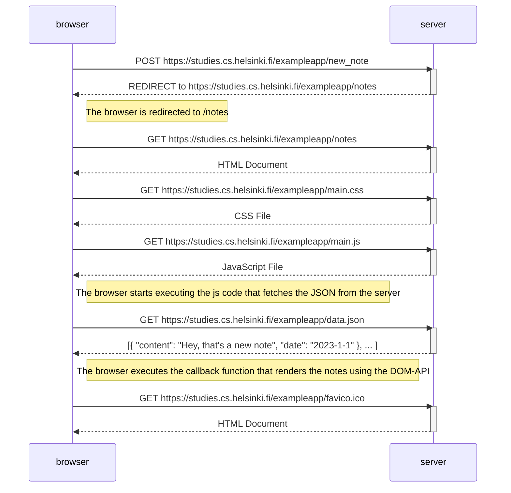

## Ex. 0.4

```mermaid

    sequenceDiagram
        participant browser
        participant server

        browser->>server: POST https://studies.cs.helsinki.fi/exampleapp/new_note
        activate server
        server-->>browser: REDIRECT to https://studies.cs.helsinki.fi/exampleapp/notes
        deactivate server

        Note right of browser: The browser is redirected to /notes

        browser->>server: GET https://studies.cs.helsinki.fi/exampleapp/notes
        activate server
        server-->>browser: HTML Document
        deactivate server

        browser->>server: GET https://studies.cs.helsinki.fi/exampleapp/main.css
        activate server
        server-->>browser: CSS File
        deactivate server

        browser->>server: GET https://studies.cs.helsinki.fi/exampleapp/main.js
        activate server
        server-->>browser: JavaScript File
        deactivate server

        Note right of browser: The browser starts executing the js code that fetches the JSON from the server

        browser->>server: GET https://studies.cs.helsinki.fi/exampleapp/data.json
        activate server
        server-->>browser: [{ "content": "Hey, that's a new note", "date": "2023-1-1" }, ... ]
        deactivate server

        Note right of browser: The browser executes the callback function that renders the notes using the DOM-API

        browser->>server: GET https://studies.cs.helsinki.fi/exampleapp/favico.ico
        activate server
        server-->>browser: HTML Document
        deactivate server
```